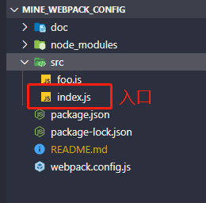

# mine_webpack_config
`webpack` 配置
## 声明
学习资料来源于掘金小册[使用webpack定制前端开发环境](https://juejin.im/book/6844733709808041992)
## webpack安装
1.创建一个新的文件夹
```
mkdir mine_webpack_config
cd mine_webpack_config
```
2.创建`package.json`文件管理项目版本和依赖
```
npm init
```
3.安装`webpack`和`webpack-cli`
```
npm install webapck webpack-cli -D
```
`webpack-cli`是`webpack`的命令行工具，从`4.x`版本后，`webpack-cli`不再作为`webpack`的依赖，使用时需要安装；

4. 创建项目源码目录及入口文件




5.安装成功后，在命令行中输入如下命令进行构建
```
npx webpack
```

执行构建命令后，项目中会出现一个dist目录，即是构建结果

6.为了方便，将构建命令配置到package.json文件的`scripts`中

``` 
"scripts": {
    "build": "webpack"
},

```

以后需要构建时，在命令行输入`npm run build`即可

## 通过webpack的简单配置文件构建

1.在根目录下创建`webpack.config.js`文件

2.在文件中编写如下代码
```
const path = require('path');
module.exports = {
    mode:'development',// 指定构建模式
    entry: './src/index.js',// 构建入口
    output: {
        path:path.resolve(__dirname,'dist'),// 指定构建生成文件所在路径
        filename:'bundle.js',//指定构建生成的文件名
    },
    
}

```

3.再次运行`npm run build`，可以输出构建结果`./dist/bundle.js`

## 本地开发(`devServer`)
在实际的开发中，我们一般不会没修改一次代码就手动执行一次构建命令，而是通过一个方便本地开发的工具,即是`webpack-dev-server`启动一个开发服务器

### webpack-dev-server的安装及使用

1.安装`webpack-dev-server`

```
npm install webpack-dev-server -D
```

2.在`package.json`文件中添加一个启动开发服务器的命令

```
"scripts": {
    "build": "webpack",
    "serve": "webpack-dev-server --open"
}
```

`--open` 服务启动后再浏览器中打开

3.创建一个`index.html`作为页面的基础,将构建结果引入

```
<!DOCTYPE html>
<html lang="en">
<head>
    <meta charset="UTF-8">
    <meta name="viewport" content="width=device-width, initial-scale=1.0">
    <title>Webpack Study</title>
</head>
<body>
    <script src="./dist/bundle.js"></script>
</body>
</html>

```

4.在`package.json`配置`devServer`
```
devServer: {
    contentBase:path.resolve(__dirname,'dist'),// 开发服务器启动路径
}

```
5.启动本地服务
```
npm run dev
```

启动后的服务地址为：`http://localhost:8080/`

## 局部安装webpack的优点
1. 指定项目需要的`webpack`版本，不同项目可以使用不同的版本
2. 从远程服务器上克隆代码，可以通过使用`npm`等包管理工具快速的安装项目所需的`webpack`依赖
3. 当一个项目需要多人协同开发时，可以保证同一项目组的成员使用相同版本的`webpack`，避免全局安装的webpack版本不一致导致的问题
